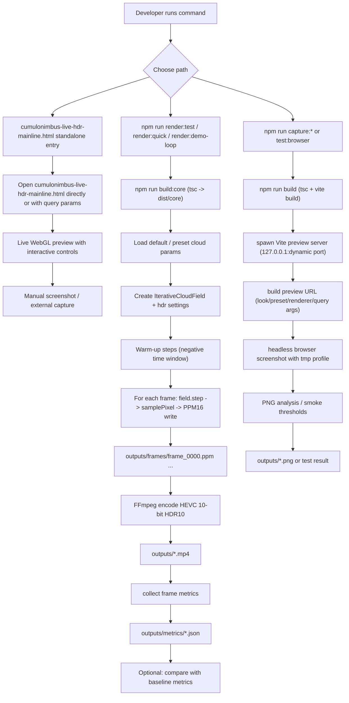

# 專案影像程式化生成與流水線（英文版）

## 目的

這份文件整理「專案影像程式化生成」的實際執行路徑：從參數設定、逐格渲染、到輸出媒體與驗證，並區分目前主線入口與歷史原型流程。

## 一眼看懂的流程圖

## 主線路徑（目前為主）

- 主線視覺入口：`cumulonimbus-live-hdr-mainline.html`
- 主線主要輸出腳本：`npm run render:quick`, `npm run render:test`, `npm run render:demo-loop`
- 主要觀察與捕捉：`npm run capture:field-still`, `npm run capture:3d-still`
- 驗證：
  - `npm run test:06`
  - `npm run test:browser`
  - `npm run test:smoke`
  - `npm run test:3d-capture`
  - `npm run test:ui-capture`
  - `npm run test:3d-looks`

## 輸出規格摘要

### 1) 離線逐格輸出（render*）

- 幀格式：16-bit PPM（`P6`）
- 編碼輸出：HEVC (`libx265`) + `yuv420p10le` + HDR10 metadata (`bt2020` / `smpte2084`)
- 常見輸出：
  - `outputs/demo/<period>/cumulonimbus-quick-hdr.mp4` (recommended tracked demo)
  - `outputs/demo/<period>/cumulonimbus-test-hdr.mp4` (recommended tracked demo)
  - `outputs/demo/<period>/cumulonimbus-demo-loop.mp4` (recommended tracked demo)
- 對應度量：
  - `outputs/demo/<period>/metrics/cumulonimbus-quick-hdr.json` (recommended tracked demo)
  - `outputs/demo/<period>/metrics/cumulonimbus-test-hdr.json` (recommended tracked demo)
  - `outputs/demo/<period>/metrics/cumulonimbus-demo-loop.json` (recommended tracked demo)

### 2) Vite 預覽與 still/capture

- 暫存幀或畫面：PNG in `outputs/`
- 常見輸出：
  - `outputs/cumulonimbus-field-still.png`
  - `outputs/cumulonimbus-3d-still.png`
- 這一路徑同時提供「可回放網址」與煙霧測試輸出。

## 常用參數節點（腳本層）

- `--width`, `--height`, `--fps`, `--seconds`
- `--seed`
- `--drift-cycle`, `--drift-amount`（`render:demo-loop`）
- `--preset` / `--look` / `--simPreset`
- `--renderer`, `--view`
- `--out`, `--metrics`（可覆寫輸出檔名）
- `--baseline`（`render:test`）

## 為什麼流程可以重複產出

流程中的可重複性來自固定的參數輸入 + `--seed` + 可選基準比對：

- `seed` 決定擾動序列
- `params` 決定雲體形態、生長規則、光照/渲染參數
- `git commit id`、`project version`、指標檔 metadata
- 固定幀率和幀數保證回放一致性

## 下一步可視化方向（規劃）

1. 將流程圖新增到 CI 產物摘要（build report）
2. 為每個 render 命令輸出「輸入參數 manifest」
3. 在輸出命名中加入時間戳與 runId，讓歷史版本更容易 diff
4. 將 capture 頁與 live page 的輸出路徑在文件中標準化為可讀表格
