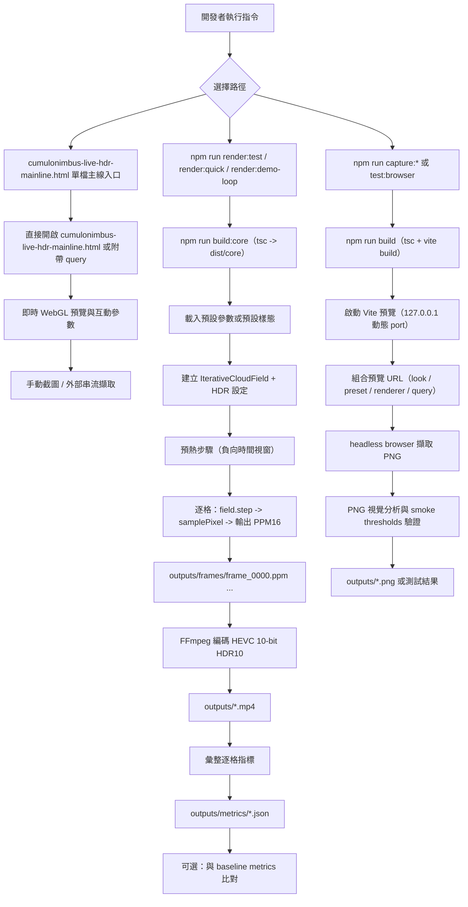

# 專案影像程式化生成與流水線

## 目的

這份文件整理專案目前可用的程式化影像輸出流程：從參數輸入、逐格渲染、到媒體輸出與驗證，並區分主線入口與測試/捕捉流程。

## 流程圖

## 主線路徑（目前使用）

- 主線視覺入口：`cumulonimbus-live-hdr-mainline.html`
- 主線輸出腳本：`npm run render:quick`, `npm run render:test`, `npm run render:demo-loop`
- 主要抓圖路徑：`npm run capture:field-still`, `npm run capture:3d-still`
- 主要驗證：
  - `npm run test:06`
  - `npm run test:browser`
  - `npm run test:smoke`
  - `npm run test:3d-capture`
  - `npm run test:ui-capture`
  - `npm run test:3d-looks`

## 輸出摘要

### 1) 逐格離線輸出（render*）

- 幀格式：16-bit PPM (`P6`)
- 編碼：HEVC (`libx265`) + `yuv420p10le` + HDR10 metadata (`bt2020` / `smpte2084`)
- 常見輸出：
  - `outputs/demo/<period>/cumulonimbus-quick-hdr.mp4`（建議追蹤版本）
  - `outputs/demo/<period>/cumulonimbus-test-hdr.mp4`（建議追蹤版本）
  - `outputs/demo/<period>/cumulonimbus-demo-loop.mp4`（建議追蹤版本）
- 對應指標：
  - `outputs/demo/<period>/metrics/cumulonimbus-quick-hdr.json`（建議追蹤版本）
  - `outputs/demo/<period>/metrics/cumulonimbus-test-hdr.json`（建議追蹤版本）
  - `outputs/demo/<period>/metrics/cumulonimbus-demo-loop.json`（建議追蹤版本）

### 2) 預覽與 still/capture

- 圖片輸出：PNG in `outputs/`
- 常見輸出：
  - `outputs/cumulonimbus-field-still.png`
  - `outputs/cumulonimbus-3d-still.png`
- 這條路徑同時供預覽 URL 與 smoke 測試回報。

## 常用參數

- `--width`, `--height`, `--fps`, `--seconds`
- `--seed`
- `--drift-cycle`, `--drift-amount`（`render:demo-loop`）
- `--preset` / `--look` / `--simPreset`
- `--renderer`, `--view`
- `--out`, `--metrics`（可自訂輸出）
- `--baseline`（`render:test`）

## 重複產出能力

可重複輸出的關鍵在於參數可控與 seed 固定：

- `seed` 控制擾動起點
- `params` 控制雲體形態、成長規則、光照與渲染
- 指標檔含 `git commit`、專案版本與運行 metadata
- 固定幀率與幀數確保可回放一致

## 下一步建議

1. 將此流程圖放入 `test:browser` 或 CI 報告
2. 每次 render 加入輸入參數 manifest
3. 輸出名稱加入 timestamp / runId，方便對比
4. 將 `outputs` 命名規則在文件中標準化

